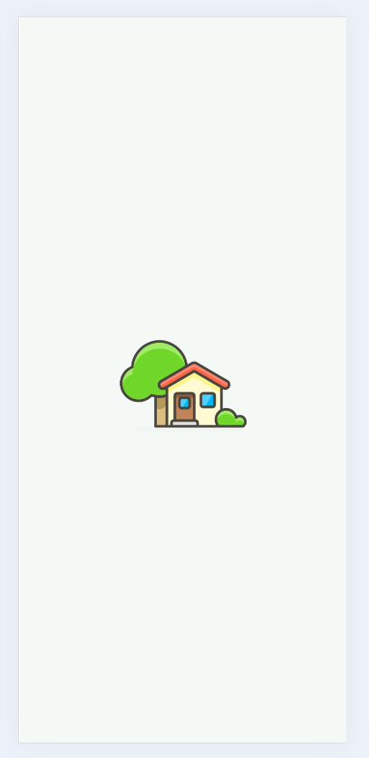
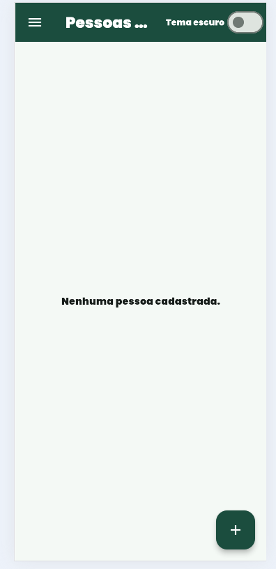
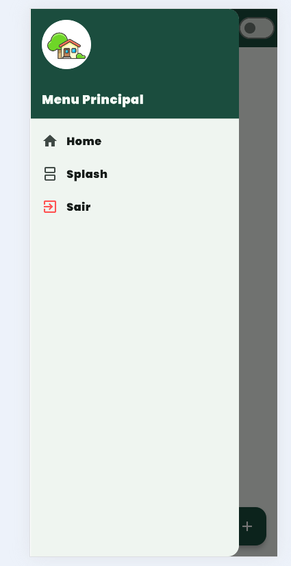
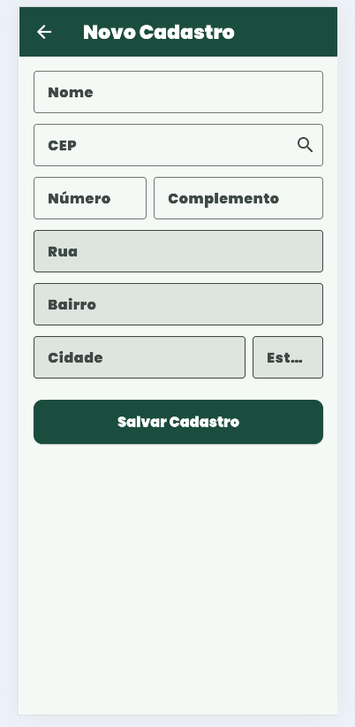
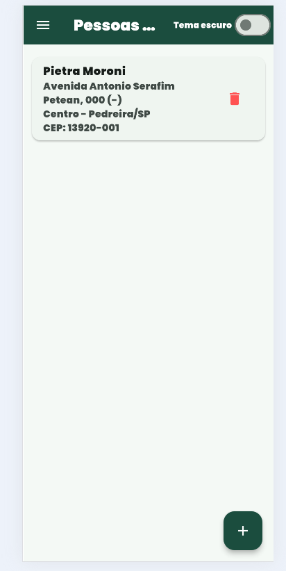
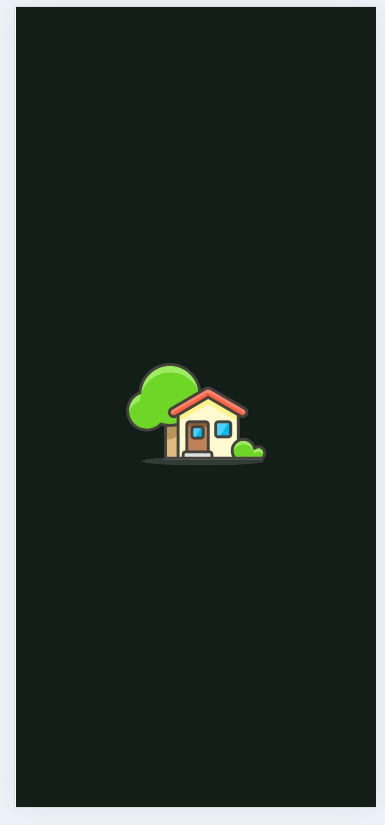
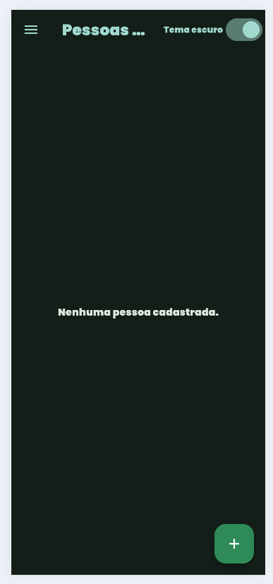
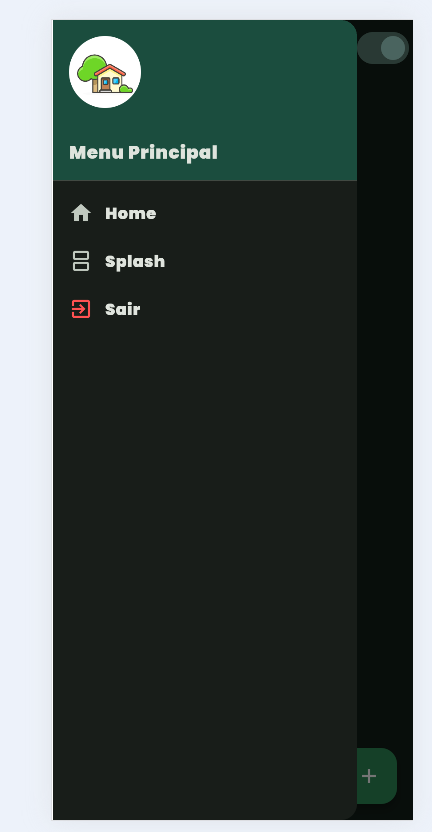
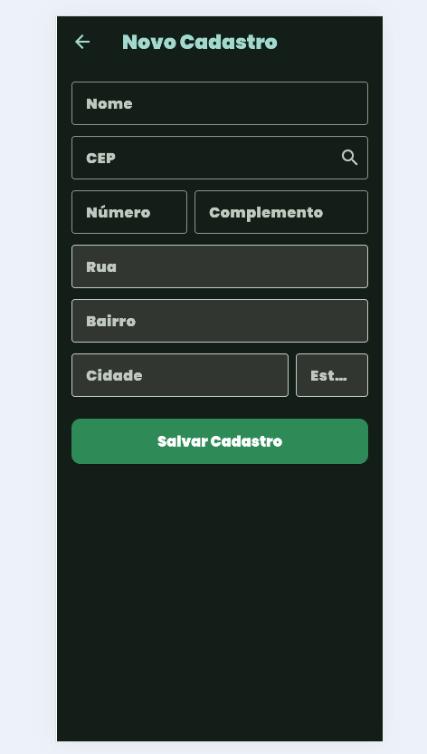
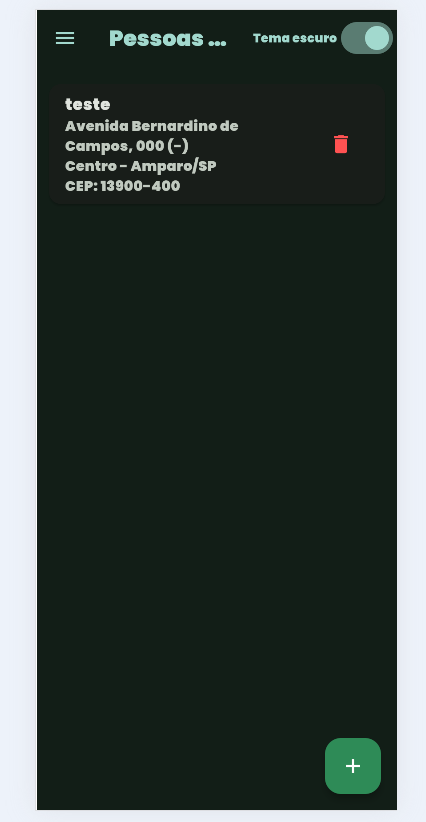

# Cadastro de Pessoas com ViaCEP (Flutter)

Aplicativo mobile desenvolvido em Flutter para cadastro e gerenciamento local de pessoas com consulta automática de endereço via CEP (API ViaCEP). 
O projeto conta com persistência de dados local, tema claro/escuro dinâmico, animação de entrada e navegação intuitiva por menu lateral (Drawer).

---

## Funcionalidades

- **RF001 - Consulta de CEP:** Preenchimento automático de logradouro, bairro, cidade e estado ao digitar um CEP válido (integração via HTTP com a API ViaCEP).
- **RF002 - Persistência Local:** Salvamento e exclusão de cadastros salvos no dispositivo usando `shared_preferences`.
- **RF003 - Animação Splash:** Tela inicial de apresentação com efeito *fade-in* da marca/ícone do app.
- **Tema Personalizado (Claro/Escuro):** Suporte a tema escuro/claro alternável dinamicamente na AppBar ou capturado via sistema.
- **Menu Lateral (Drawer):** Navegação simplificada contendo botão para rever a Splash Screen e opção para encerrar/sair da aplicação.
- **Fonte do Google Fonts:** Utilização da tipografia **Poppins** no ecossistema da aplicação.

---

## Layout e Telas (Tema Claro)

| 1. Tela Inicial | 2. Home Vazia | 3. Menu Lateral |
| :---: | :---: | :---: |
|  |  |  |

| 4. Cadastro CEP | 5. Registros | 6. Home com Registros |
| :---: | :---: | :---: |
|  | [!Registros](assets/fotos/registros_claro.png) |  |

---

## Layout e Telas (Tema Escuro)

| 1. Tela Inicial | 2. Home Vazia | 3. Menu Lateral |
| :---: | :---: | :---: |
|  |  |  |

| 4. Cadastro CEP | 5. Registros | 6. Home com Registros |
| :---: | :---: | :---: |
|  | [!Registros](assets/fotos/registros_escuro.png) |  |

## Tecnologias e Pacotes Utilizados

- **[Flutter](https://flutter.dev/):** Framework para desenvolvimento multiplataforma.
- **[http](https://pub.dev/packages/http):** Para consumo da API REST do ViaCEP.
- **[shared_preferences](https://pub.dev/packages/shared_preferences):** Armazenamento de dados do tipo Key-Value na memória local.
- **[Google Fonts (Poppins)](https://fonts.google.com/specimen/Poppins):** Fonte customizada integrada.

---

## Como Executar o Projeto

### Pré-requisitos
- **Flutter SDK** instalado (versão `>=3.0.0`).
- Dispositivo Android/iOS configurado ou Emulador.

### Passo a Passo

1. **Clone este repositório:**
   ```bash
   git clone [https://github.com/SEU_USUARIO/flutter_cep.git](https://github.com/SEU_USUARIO/flutter_cep.git)